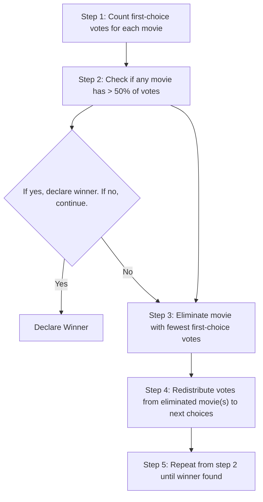

# Business Logic Documentation

> **Auto-generated document** - Do not edit directly!  
> Source: `docs/machine-readable/business-logic.json`  
> Generated: 2025-06-20T01:02:57.590Z

---

## Table of Contents

- [Core Purpose](#core-purpose)
- [Business Rules](#business-rules)
- [Algorithms](#algorithms)
- [Invariants](#invariants)
- [Priorities](#priorities)
- [Constraints](#constraints)

## Core Purpose

> Enable fair, democratic movie selection through ranked choice voting without requiring user accounts

## Business Rules

### Voting Rules

#### rule_one_vote

**Description:** Each user session can only submit one vote per voting session

| Aspect | Details |
|--------|----------|
| Implementation | Check votes table for existing user_session_id + voting_session_id |
| Enforcement | Server-side validation in /api/votes |
| Error Message | "You have already voted in this session" |
| Testable | ✅ Yes |
| Test File | `__tests__/api/votes.test.ts` |

#### rule_min_movies

**Description:** Users must rank at least one movie to submit a vote

| Aspect | Details |
|--------|----------|
| Implementation | Validate rankings array length > 0 |
| Enforcement | Client and server validation |
| Error Message | "Please rank at least one movie" |
| Testable | ✅ Yes |

#### rule_valid_ids

**Description:** All movie IDs in rankings must exist in the database

| Aspect | Details |
|--------|----------|
| Implementation | Verify each ID exists in movies table |
| Enforcement | Server-side validation |
| Error Message | "Invalid movie selection" |
| Testable | ✅ Yes |

#### rule_no_duplicates

**Description:** Each movie can only appear once in a user's ranking

| Aspect | Details |
|--------|----------|
| Implementation | Check for unique values in rankings array |
| Enforcement | Client and server validation |
| Error Message | "Each movie can only be ranked once" |
| Testable | ✅ Yes |

#### rule_partial_ballots

**Description:** Users can rank a subset of available movies

| Aspect | Details |
|--------|----------|
| Implementation | No requirement to rank all movies |
| Enforcement | undefined |
| Testable | ✅ Yes |

### Movies Rules

#### rule_unique_tmdb

**Description:** No duplicate movies based on TMDB ID

| Aspect | Details |
|--------|----------|
| Implementation | Check tmdb_id before insertion |
| Enforcement | Database constraint and API validation |
| Error Message | "This movie has already been added" |
| Testable | ✅ Yes |

#### rule_title_required

**Description:** Every movie must have a title

| Aspect | Details |
|--------|----------|
| Implementation | Non-null, non-empty title field |
| Enforcement | Database constraint and API validation |
| Error Message | "Movie title is required" |
| Testable | ✅ Yes |

#### rule_open_addition

**Description:** Any user can add movies without authentication

| Aspect | Details |
|--------|----------|
| Implementation | No auth check on POST /api/movies |
| Enforcement | undefined |
| Testable | ✅ Yes |

### Sessions Rules

#### rule_auto_session

**Description:** User sessions are created automatically on first interaction

| Aspect | Details |
|--------|----------|
| Implementation | Generate UUID, store in localStorage |
| Enforcement | undefined |
| Testable | ✅ Yes |

#### rule_persistent

**Description:** Sessions persist across browser refreshes

| Aspect | Details |
|--------|----------|
| Implementation | localStorage for session ID |
| Enforcement | undefined |
| Testable | ✅ Yes |

#### rule_anonymous

**Description:** No personal information collected or required

| Aspect | Details |
|--------|----------|
| Implementation | UUID-only identification |
| Enforcement | undefined |
| Testable | ✅ Yes |

### Admin Rules

#### rule_admin_auth

**Description:** Admin panel requires password authentication

| Aspect | Details |
|--------|----------|
| Implementation | Check ADMIN_SECRET env variable |
| Enforcement | Server-side validation |
| Testable | ✅ Yes |

#### rule_admin_powers

**Description:** Admins can close voting, reset data, and delete movies

| Aspect | Details |
|--------|----------|
| Implementation | undefined |
| Enforcement | undefined |
| Testable | ✅ Yes |

## Algorithms

### Instant Runoff Voting (IRV)

**ID:** `algo_irv`  
**Description:** Eliminates lowest-scoring candidates until one has majority

#### Implementation Flow



#### Edge Cases

| Case | Result | Handling |
|------|--------|----------|
| No votes cast | No winner declared | Show appropriate message |
| All movies tied | First movie by ID wins | Deterministic tie-breaking |
| Partial ballots | Only counted for ranked movies | Exhausted ballots don't count in later rounds |

### Borda Count Points

**ID:** `algo_points`  
**Description:** Points awarded based on ranking position

#### Formula

```
points = (total_movies - position + 1)
```

#### Examples

| Position | Total Movies | Points |
|----------|--------------|--------|
| 1 | 5 | 5 |
| 2 | 5 | 4 |
| 5 | 5 | 1 |

## Invariants

These are conditions that must **always** be true:

### inv_session_integrity

> A voting session's results cannot change after closing

- **Implementation:** Immutable after status = 'closed'
- **Verification:** No votes accepted after closing

### inv_vote_immutable

> Votes cannot be modified after submission

- **Implementation:** No UPDATE operations on votes table

### inv_movie_available

> All movies remain available throughout voting session

- **Implementation:** No deletion during open session
- **Exception:** Admin can delete if necessary

### inv_anonymous

> Individual votes are never publicly associated with sessions

- **Implementation:** Results show aggregate only

## Priorities

### Feature Priorities

| Feature | Priority | Description | Rationale |
|---------|----------|-------------|------------|
| Core voting flow | **P0 - Critical** | Add movies, rank them, submit vote, see results | Minimum viable product |
| Real-time updates | **P1 - High** | Live result updates via WebSocket | Enhanced user experience |
| Mobile optimization | **P1 - High** | Touch-friendly interface for mobile | Most users on mobile devices |
| Rich movie data | **P2 - Medium** | Posters, cast, ratings from TMDB | Helps users make informed choices |
| Admin panel | **P2 - Medium** | Management interface for operators | Needed for production use |
| Offline support | **P3 - Low** | Basic functionality without internet | Nice to have for reliability |

### Performance Requirements

| Metric | Target | Priority |
|--------|--------|----------|
| Page load time | < 3 seconds on 3G | P1 - High |
| Vote submission | < 1 second response | P0 - Critical |
| Result calculation | < 500ms for 1000 votes | P1 - High |

## Constraints

### Technical Constraints

#### Supabase free tier limits

- **Limit:** 500MB database, 2GB bandwidth
- **Mitigation:** Efficient data storage, caching

#### Vercel function timeout

- **Limit:** 10 seconds max execution
- **Mitigation:** Optimize IRV algorithm

#### TMDB API rate limit

- **Limit:** 40 requests per 10 seconds
- **Mitigation:** Client-side caching, debouncing

### Business Constraints

#### No user accounts

- **Rationale:** Reduce friction for participation
- **Implication:** Session-based tracking only

#### Free to use

- **Rationale:** Accessible to everyone
- **Implication:** Must work within free tier limits

