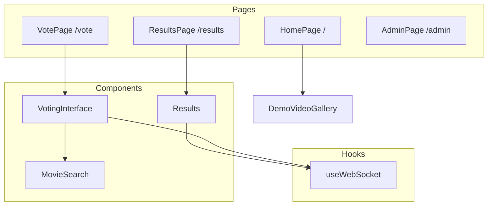
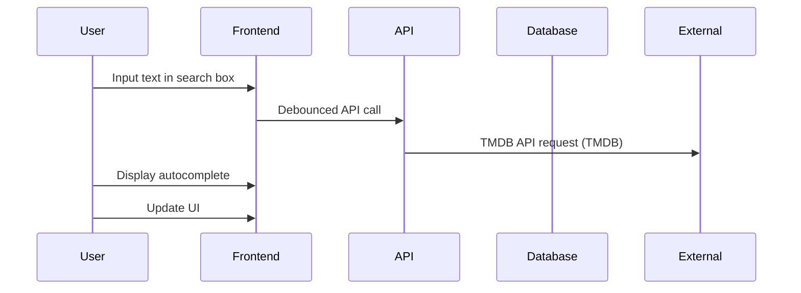
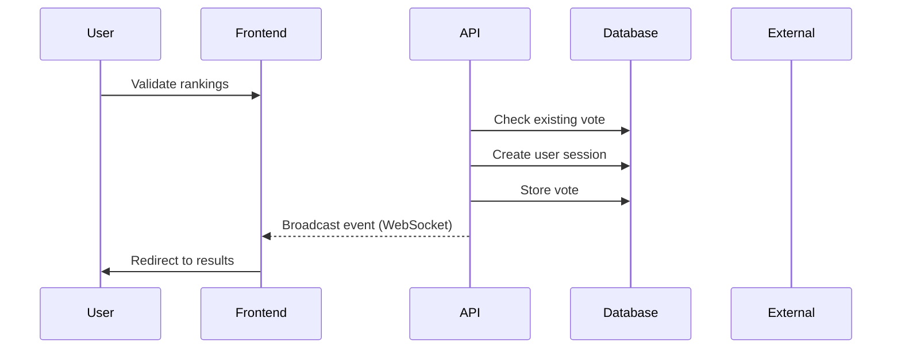
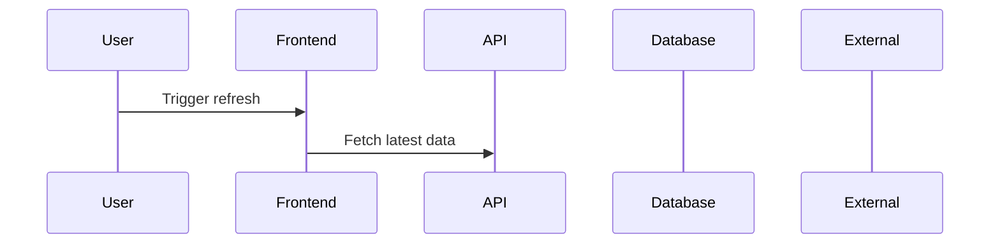
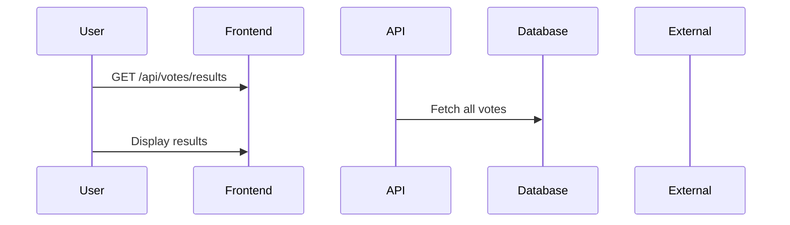
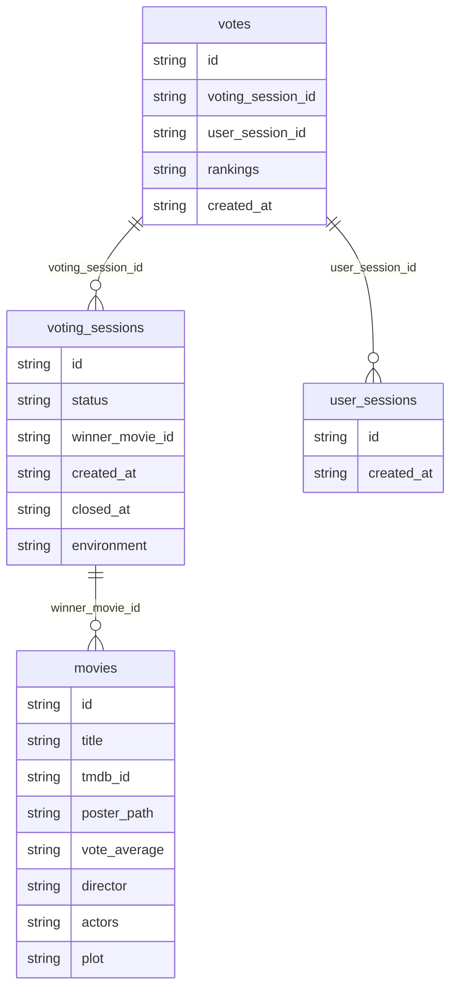

# System Architecture Diagram

> **Auto-generated document** - Do not edit directly!  
> Source: `docs/machine-readable/system-diagram.json`  
> Generated: 2025-06-20T01:02:57.588Z

---

## Table of Contents

- [Component Overview](#component-overview)
- [API Routes](#api-routes)
- [Data Flow](#data-flow)
- [Database Schema](#database-schema)
- [State Management](#state-management)
- [Deployment](#deployment)

## Component Overview

### Frontend Architecture

### Pages

| Path | Component | Purpose | State Type |
|------|-----------|---------|------------|
| / | app/page.tsx | Landing page with value proposition | none |
| /vote | app/vote/page.tsx | Movie selection and ranking interface | session-based |
| /results | app/results/page.tsx | Live voting results display | real-time updates |
| /admin | app/admin/page.tsx | Administrative controls | authenticated |

### Components

#### comp_voting_interface

- **File:** `components/VotingInterface.tsx`
- **State:** movies, rankings, hasVoted

#### comp_movie_search

- **File:** `components/MovieSearch.tsx`
- **State:** None
- **Props:** onMovieSelect, existingMovies
- **API Calls:** /api/movies/search

#### comp_results

- **File:** `components/Results.tsx`
- **State:** results, voteCount, winner
- **API Calls:** /api/votes/results, /api/votes/count

## API Routes

| Endpoint | Methods | Purpose | Auth Required |
|----------|---------|---------|---------------|
| /api/movies | GET, POST, DELETE | app/api/movies/route.ts | ❌ No |
| /api/movies/search | GET | app/api/movies/search/route.ts | ❌ No |
| /api/votes | POST | app/api/votes/route.ts | ❌ No |
| /api/votes/results | GET | app/api/votes/results/route.ts | ❌ No |
| /api/voting-session | GET, POST | Manage voting lifecycle | ❌ No |
| /api/admin/* | POST, GET | undefined | 🔒 Yes |

## Data Flow

### Flow Add Movie

**Trigger:** User searches for movie

### Flow Submit Vote

**Trigger:** User clicks submit vote

### Flow Real Time Updates

**Trigger:** WebSocket connection

### Flow Calculate Winner

**Trigger:** Results page load or refresh

## Database Schema

## State Management

### Client-Side State

#### React Component State

| Component | State Variables | Purpose |
|-----------|----------------|----------|
| VotingInterface | movies, rankings, isSubmitting | Component-specific UI state |
| Results | results, voteCount, lastUpdated | Component-specific UI state |
| Admin | isAuthenticated, stats | Component-specific UI state |

#### Local Storage

| Key | Type | Purpose |
|-----|------|----------|
| voting-session-id | UUID | Track user session |
| has-voted | boolean | Prevent duplicate votes |

## Deployment

### Environment Configuration

| Environment | Database | API | WebSocket |
|-------------|----------|-----|------------|
| development | Local PostgreSQL via Docker | Next.js dev server | Local Node.js server |
| production | Supabase PostgreSQL | Vercel Serverless Functions | Separate Node.js server |
| test | Test Supabase project | undefined | undefined |
