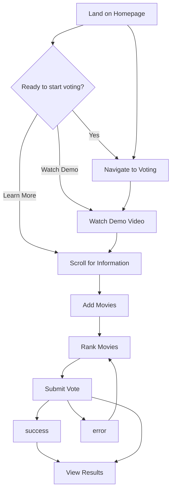
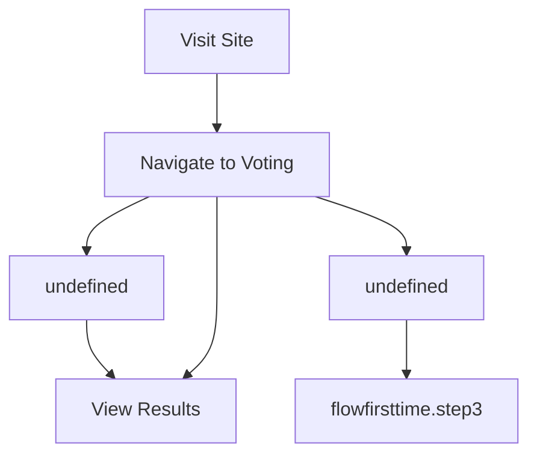
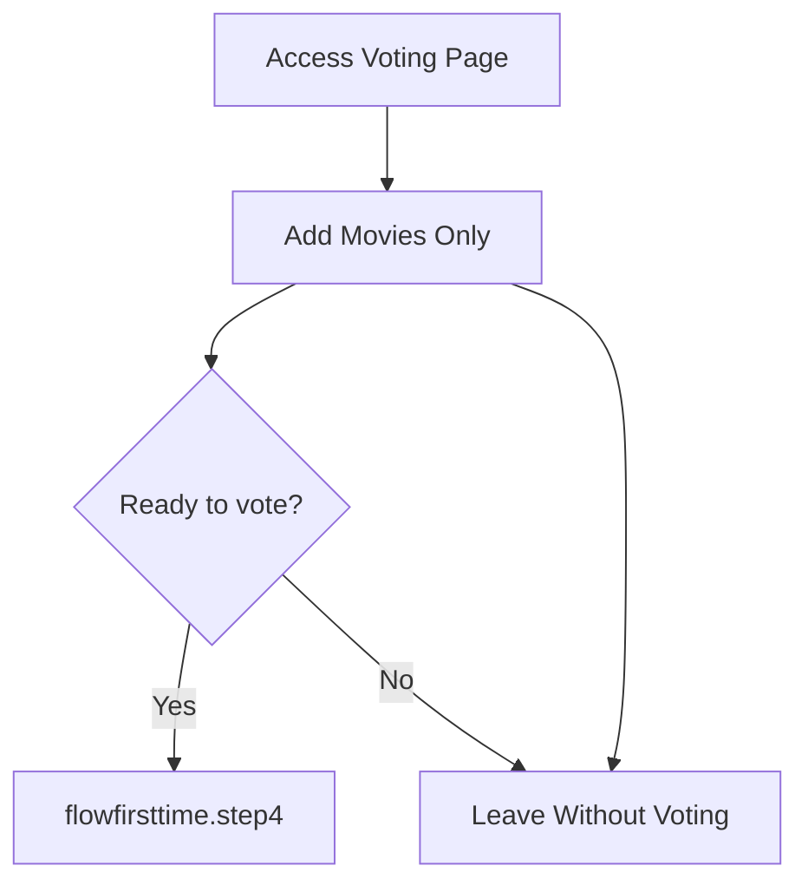
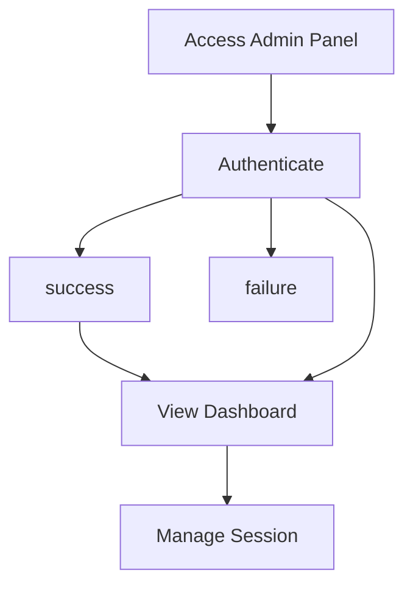
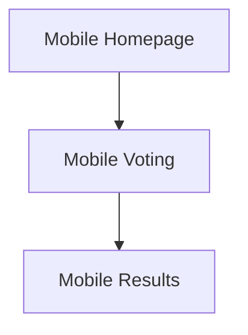

# User Flows Documentation

> **Auto-generated document** - Do not edit directly!  
> Source: `docs/machine-readable/user-flows.json`  
> Generated: 2025-06-20T01:02:57.587Z

---

## Table of Contents

- [Overview](#overview)
- [User Flows](#user-flows)
- [Interactive Elements](#interactive-elements)
- [Error States](#error-states)

## Overview

This document describes all user journeys through the NoSpoilers application, including:
- Step-by-step flows for different user types
- Interactive elements on each page
- Error states and edge cases

## User Flows

### First Time Visitor Flow

**ID:** `flow_first_time`  
**Description:** Journey of a new user discovering and using NoSpoilers

#### Flow Steps

| Step | Page | Actions | Validations |
|------|------|---------|-------------|
| Land on Homepage | / | View hero section, Read value proposition | - |
| Navigate to Voting | /vote | View empty movie list, See add movie interface | - |
| Watch Demo Video | / | Watch demonstration, Pause/resume video | - |
| Scroll for Information | / | Read features, View how it works | - |
| Add Movies | /vote | Search for movies, Select from autocomplete, Add multiple movies | At least one movie required, No duplicate movies |
| Rank Movies | /vote | Drag to reorder, Click position buttons, Remove movies | At least one movie must be ranked |
| Submit Vote | /vote | Validate rankings, Store vote, Create session | - |
| View Results | /results | See current standings, View vote count, Check winner | - |

### Returning Voter Flow

**ID:** `flow_returning`  
**Description:** User who has already voted checking results

#### Flow Steps

| Step | Page | Actions | Validations |
|------|------|---------|-------------|
| Visit Site | / | Check if already voted | - |
| Navigate to Voting | /vote | - | - |
| View Results | /results | Monitor live results, See final winner when closed | - |

### Movie Suggester Flow

**ID:** `flow_suggester`  
**Description:** User adding movies without voting

#### Flow Steps

| Step | Page | Actions | Validations |
|------|------|---------|-------------|
| Access Voting Page | /vote | View current movie list | - |
| Add Movies Only | /vote | Search and add movies, See movies appear in list | - |
| Leave Without Voting | - | Movies remain available for others, No vote recorded | - |

### Admin Management Flow

**ID:** `flow_admin`  
**Description:** Administrative actions for managing voting sessions

#### Flow Steps

| Step | Page | Actions | Validations |
|------|------|---------|-------------|
| Access Admin Panel | /admin | - | Correct admin password required |
| Authenticate | /admin | Enter username, Enter password, Submit credentials | - |
| View Dashboard | /admin | See statistics, View current session, Check vote count | - |
| Manage Session | /admin | [object Object], [object Object], [object Object] | - |

### Mobile User Flow

**ID:** `flow_mobile`  
**Description:** Optimized flow for mobile device users

#### Flow Steps

| Step | Page | Actions | Validations |
|------|------|---------|-------------|
| Mobile Homepage | / | - | - |
| Mobile Voting | /vote | Tap to add movies, Use position buttons for ranking | - |
| Mobile Results | /results | - | - |

## Interactive Elements

### Homepage Page

#### Buttons

| Button | Type | Action | Location | Mobile |
|--------|------|--------|----------|--------|
| Start Voting Now | primary | navigate | hero section | ✅ |
| Watch Demo | secondary | play_video | hero section | ✅ |
| Create Voting Session | primary | navigate | CTA section | ✅ |

#### Videos

- **main_demo_video** in hero section
  - Controls: play, pause, fullscreen
  - Autoplay: No, Muted: Yes

### Voting_page Page

#### Buttons

| Button | Type | Action | Location | Mobile |
|--------|------|--------|----------|--------|
| Submit Vote | primary | submit_form | undefined | ❌ |
| ↑ | icon | reorder | undefined | 📱 Only |
| ↓ | icon | reorder | undefined | 📱 Only |
| × | icon | remove | each ranked movie | ❌ |

#### Input Fields

- **input_movie_search**: text input
  - Placeholder: "Search for a movie..."
  - Features: autocomplete, debounced search, TMDB integration
  - Validations: non-empty, min 2 characters for search

### Results_page Page

### Admin_page Page

#### Buttons

| Button | Type | Action | Location | Mobile |
|--------|------|--------|----------|--------|
| Login | primary | authenticate | undefined | ❌ |
| Close Voting | danger | close_session | undefined | ❌ |
| Reset All Data | danger | reset_session | undefined | ❌ |
| Delete | danger | delete_movie | each movie row | ❌ |

#### Input Fields

- **input_username**: text input
  - Placeholder: "Username"

- **input_password**: password input
  - Placeholder: "Password"

## Error States

| Error | Pages | Message | Handling |
|-------|-------|---------|----------|
| no_movies | /vote | No movies added yet. Be the first to suggest a movie! | Show empty state with search prompt |
| already_voted | /vote | Thanks for voting! You can view the results to see how others are voting. | Show message with link to results |
| no_votes | /results | No votes yet. Be the first to vote! | Show empty state with link to voting |
| api_error | all | Something went wrong. Please try again. | Show error message with retry button |
| offline | all | You appear to be offline. Some features may not work. | Show offline indicator, disable real-time features |
